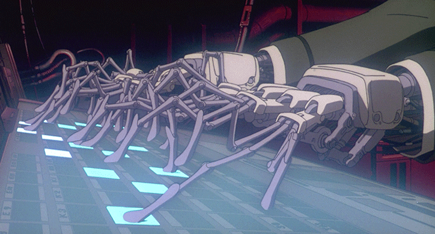

  

  

Welcome to my GitHub profile - this is where I dump all my poorly written code,
unfinished scripts and all my dirty laundry for everyone to witness! I have been
a lurker for the longest time mostly committing on private repositories, but I
look forward to sharing more open source software.

A few things about my life as a developer:

* 💻 I am a mechanical engineer by training, but I work a lot closer to applied
  robotics and simulation than I do to mechanical design. I lie somewhere
  where the rubber meets the ones and zeroes!
* 🤖 Mobile robotics has been one of my primary interests since my doctoral
  studies, and I still try my best to keep up with it.  
  If you are feeling curious, you can find more on [→ github.com/au-agv ←](https://github.com/au-agv)
* 📢 I am a strong advocate for open-source software (OSS) principles and for
  digital autonomy. Somewhat still star struck by the humble origins of the
  software that holds the world together.

> [!NOTE]
> The GIF above is from the 1995 animated film Ghost in the Shell, directed by
> Mamoru Oshii. A strange and distorted, but also fascinating view of robotics
> and human interfaces from the perspective of over three decades ago. If you
> have not watched it, enjoy one of the great movies from the 90s!

## My GitHub statistics and badges 🏆

Here are my badges and language statistics on GitHub. Not exactly representative
of my activity as a developer, as they exclude contributions to other
organizations, but they are shiny and colorful and that is all that really
matters!

  

  
  

## My GitHub contributions

  <picture>
    <source
      media="(prefers-color-scheme: dark)"
      srcset="./assets/cards/github-snake-dark.svg"
    />
    <source
      media="(prefers-color-scheme: light)"
      srcset="./assets/cards/github-snake.svg"
    />
    
  </picture>

## What I am busy working on at the moment 🔧

These are repositories I am actively contributing to at the moment! Hopefully I
will remember to update this list every once in a while! 📝

  

  

## My all time favourite GitHub repositories ❤️

Here are just a few repositories I am occasionally checking out. They definitely
deserve some of your time !

  

  

  

  

